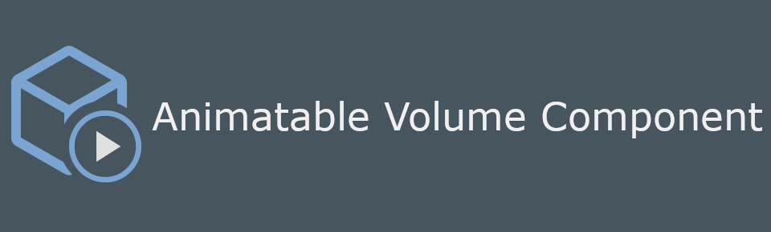
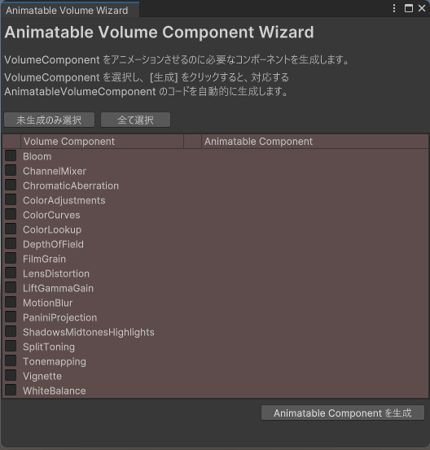
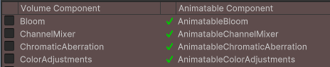
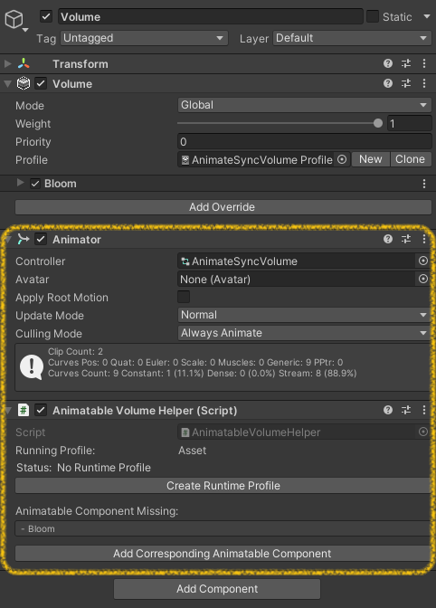
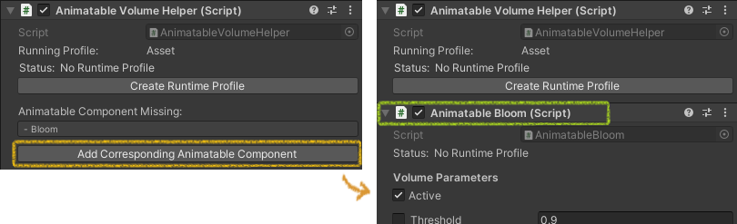
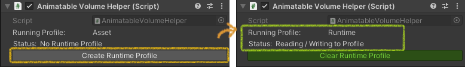
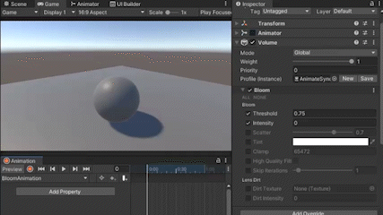
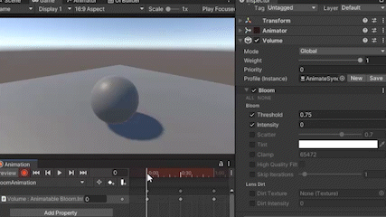

# ▶　Animatable Volume Component

**Animatable Volume Component** provides an interface for animating the URP PostProcessing Volumes. Use this component to give your game more interactive and dynamic look.
 For English README, please see look at: 👉 [README_EN.md](./README_en.md)

**Animatable Volume Component** は、URP 及び HDRP のポストプロセス Volume をアニメーションさせるためのインターフェースを提供します。 このコンポーネントを使用して、より臨場感のあるシーンや演出を作ることができます。

  

# 特徴

Animatable Volume Component 以下の特徴を有します：

1. `Volume Profile` に対して、いつもの操作で簡単にアニメーションのキーを打ち、再生させることが出来る
2. コード分析・自動生成により、
   - Unity のバージョンごとのパラメータ変更を吸収できる
   - カスタムな `Volume Component` に対してもアニメーションさせることができる
3. ツール導入前後、アニメーション時以外の Volume の操作は一切変わらない

 

# 導入

[Github レポジトリ](https://github.com/cji3bp62000/AnimatableVolumeComponent) の右サイドバーの Releases から、最新版の unitypackage をダウンロードして、プロジェクトにインポートしてください。

# 使い方

0. （一度のみ）アニメーション用の補助コンポーネントの自動生成
1. アニメーション用の補助コンポーネントを Volume のゲームオブジェクトにアタッチ
2. アニメーションキーイング

 

## 1. (下準備) 補助コンポーネントの自動生成

本コンポーネントの UnityPackage を導入後、メニューの `Tools > Animatable Volume > Animatable Volume Wizard` を選択します。下記のようなポップアップが表示されます。

　
> プロジェクト内に存在する `VolumeComponent` のリスト

 
アニメーションさせたい `VolumeComponent` にチェックを入れ、［生成］ボタンを押して、`VolumeComponent` に対応した補助コンポーネント（`Animatable + 元のコンポーネント名`）を生成します。

　

これでアニメーションをさせるための下準備は完了です。

 

## 2. 補助コンポーネントのアタッチ

アニメーションをさせたい `Volume` のゲームオブジェクトに、`Animator` 及び `AnimatableVolumeHelper` をアタッチします。

　

 

`AnimatableVolumeHelper` のインスペクターの［Add Corresponding Animatable Component］を押して、各 `VolumeComponent` に対応した補助コンポーネントを追加します。

　

 

補助コンポーネントはランタイムの Profile にのみ作動するので、`AnimatableVolumeHelper` の［Create Runtime Profile］を押して、Profile アセットのコピーを生成します。 （自動で生成される場合があります）

　

 

## 3. アニメーションキーイング

補助コンポーネントをアタッチ後、後はいつものアニメーションの付け方と同じです。
 アニメーションウィンドウを開き、アニメーションさせたい時間点に、Profile の値を設定して、キーを打っていきます。

　

 

キーを打ち終わった後、アニメーションをプレビューして、出来を確認します。

　

 

アニメーションに問題が無ければ、アニメーションをアニメーターコントローラーに組み込んで、ゲームを実行すると再生されます。

#