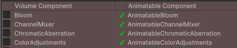
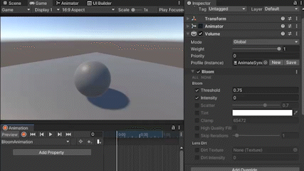

# ▶　Animatable Volume Component

**Animatable Volume Component** provides an interface for animating the URP/HDRP PostProcessing Volumes. Use this component to give your game more interactive and dynamic look.

# Features

Animatable Volume Component has the following features:

1. easy to key and play animations for each post-process parameter, just like ordinary animation-keying
2. By automatic code analysis and code generation,
    - the package absorbs parameter changes between different Unity versions
    - it is also possible to animate your custom `VolumeComponent`.
3. No code needed

# Installation

Download the latest version of unitypackage from Releases on the right sidebar of [github repository](https://github.com/cji3bp62000/AnimatableVolumeComponent), and import it into your project.

# Usage

This section describes how to animate each parameter of the post-process using the Animatable Volume Component.

Follow the steps below to create an animation of VolumeComponent.

- (one time preparation) Automatic code generation of helper components for each `VolumeComponent`
  - Helper components are just for animation info storing, no need to learn how to use them
- Attach helper components to the Volume GameObject
- Animation keying

## 0. (one time preparation) Automatic generation of helper components

After installing the UnityPackage for this component, select `Tools > Animatable Volume > Animatable Volume Wizard` from the menu. The following popup will appear.

　
> List of existing `VolumeComponents` in the project

 

Check the `VolumeComponent` you want to animate and press the Generate button to generate a helper component (`Animatable + original component name`) for the `VolumeComponent`.

　

 

## 1. Attach helper components to the Volume GameObject

Attach `Animator` and `AnimatableVolumeHelper` component to the `Volume` game object to be animated.

 

Press ［Add Corresponding Animatable Component］ button in the Inspector of the `AnimatableVolumeHelper` to helper components corresponding to each `VolumeComponent` in Volume Profile.

 

Helper components could only write values to runtime Profiles, because we don't want to change Profile-asset's value, since it will be permanent change in project.

Hence, to create a Runtime Profile, press ［Create Runtime Profile］  in `AnimatableVolumeHelper`, and a copy of the Profile asset will be generated. (it may be generated automatically, sometimes)

*`AnimatableVolumeHelper` will create a new Runtime Profile on `Start()` everytime, so no any operation needed when playing.
**AnimatableComponents are mainly used for recording animations, so no special operations are required after attaching them.

 

## 2. Animation keying

After attaching the helper components in session 1, the rest of the process is the same as usual for adding animation. 
Open the Animation Window, set the Profile value to the time point you want to animate, and adjust the parameter to the desired value.

After finished keying, you can preview the animation to check the result.

If the animation is fine, set the AnimationClip to the proper state of the animator controller, and play back will start when entering the state.

# Implementation Details
This section describes the implementation of the AnimatableVolumeComponent.

One drawback of animating URP and HDRP post-process parameters is that the `VolumeComponent` that holds the parameters is `ScriptableObject`, hence technically it is impossible to key them in Animation.

To deal with this, this package automatically generates a MonoBehaviour version of each VolumeComponent as an helper component. For example, if a `Bloom` component is detected, a MonoBehaviour called `AnimatableBloom` will be generated.

MonoBehaviour could be animated, so by animating the MonoBehaviour and setting the values back to VolumeComponent during `LateUpdate()`, the system could indirectly animate the VolumeComponent's parameters.

# Limitations

The Animatable Volume Component has the following known limitations``

- It is not possible to animate AnimationCurve and other parameters that is a class.
   - This is a limitation of the Unity animation system. If this happens in your custom post-processing component, use struct instead of class
  
- When animation-keying the `LiftGammaGain` component of URP/HDRP, the screen sometimes flickers.
   - It seems that `LiftGammaGain`'``s editor is incompatible with the editor. It should be no problem during playback.
